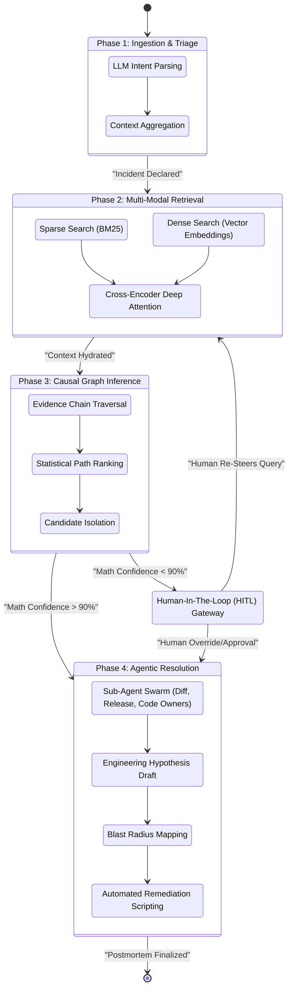
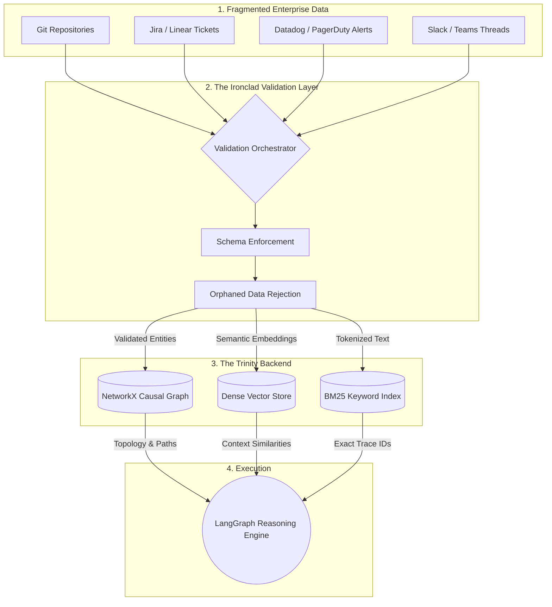

<div align="center">

# Codentir
**Beyond observability. Into investigation.**

*Engineering Investigation Engine for modern software organizations.*

</div>

### Let's be real about the problem.
When production goes down, it is absolute chaos. You are digging through Slack threads, jumping into Jira, staring at Datadog dashboards, and trying to remember who pushed what commit three hours ago. Mean Time To Resolution (MTTR) sucks because humans simply cannot connect the dots across five different tools fast enough when millions of dollars are on the line.

### Enter Codentir.
We built Codentir to be a ridiculously smart, ultra-agentic virtual SRE. We didn't just build a basic wrapper that lets you "chat with your logs." We built a massive, autonomous reasoning engine that ingests your entire engineering reality, connects the dots, and literally tells you what broke and how to fix it.

## OUR MOAT: The Ultra-Agentic End-to-End System

Here is why Codentir is miles ahead of anything else out there. We built a massive 11-stage LangGraph workflow. It does not just search; it thinks, investigates, and proves its work. 

Here is exactly what happens under the hood when you give it an incident. This pipeline is our absolute moat:

1. **Semantic Understanding Engine:** First, the LLM reads the room. It parses your query to figure out if you are just asking a general architecture question or if production is literally on fire and it needs to start a hardcore investigation.
2. **Hybrid Discovery (The Smart Search):** We don't just rely on basic vector search. We use a heavy-duty 3-way hybrid setup. BM25 catches exact trace IDs. Dense vectors grab the semantic meaning. Then a Cross-Encoder reranker hits the results with deep attention so the most critical context floats to the very top.
3. **Evidence Chain Extraction (The Detective):** This is where it gets crazy. Codentir walks through a NetworkX knowledge graph. It actively links a broken deployment back to a specific Jira ticket, which links to a Slack alert, which links to a PR. It builds the causal chain from scratch.
4. **Path & Cause Ranking:** It statistically scores every single causal path it found. It isolates the exact bad commit or config change out of thousands of possibilities.
5. **Change Intelligence Deep-Dive:** Once it flags a bad commit, it spins up specialized sub-agents. These look at deployment windows, release branches, code diffs, and even code owners to figure out exactly what syntax caused the crash.
6. **Hypothesis Generation:** It drafts a concrete, engineering-grade theory of why things broke based on the evidence.
7. **Blast Radius Calculator:** Before you even ask, it maps forward in the graph to tell you what else is going to break because of this issue. Downstream microservices? Database schemas? It knows.
8. **Action Plan & Remediation:** It tells you exactly how to fix it. Revert this commit, run this script, or flip this feature flag.
9. **The Final Report:** It writes the postmortem for you. Done.

### The Fail-Safe: Dynamic Human-In-The-Loop
We know AI can hallucinate, so we hardcoded a stop-gap. If the system is not 90% confident in its root cause analysis at the ranking stage, it completely stops. It refuses to guess. It pings a human engineer, shows its top theories, asks for a course correction, and then injects that human feedback right back into its brain to keep going.



## The Foundation: A Validated Knowledge Graph

Before the agentic loop even wakes up, we have to make sure the data is flawless. 

Codentir ingests Git commits, Jira tickets, incidents, and Slack messages. But we don't just dump them into a database. We run them through a strict Validation Orchestrator that enforces data schemas. If the data is garbage, it gets rejected. The clean data gets wired into a massive NetworkX graph. This is how we mathematically eliminate hallucination risks from orphaned data.



## Deep Dive Documentation

Want to know exactly how the engine ticks? Check out our core architecture docs:
- [The Agentic Reasoning Loop](docs/agentic_reasoning.md)
- [Hybrid Retrieval System](docs/hybrid_retrieval.md)
- [The Causal Knowledge Graph](docs/knowledge_graph.md)

## How to run this beast

We made it super easy to fire up on your local machine. Just make sure your environment variables are set up (like your `GROQ_API_KEY`) and hit the CLI. We highly recommend passing the `--agent` flag so you get the full LangGraph reasoning experience instead of just the basic retrieval.

```bash
python -m src.codentir.cli \
    --data-dir "data" \
    --tenant-id "tenant_default" \
    --query "Payment gateway is throwing 500s right now" \
    --agent
```

### What those flags actually do:
| Argument | What it does | Required |
| :--- | :--- | :---: |
| `--data-dir` | Points to the folder where your ingested system artifacts live. | Yes |
| `--tenant-id` | Multi-tenant isolation so you don't mix up customer data. | Yes |
| `--query` | Tell the system what is broken or what you want to know. | Yes |
| `--agent` | Flips the switch to turn on the massive 11-stage reasoning loop. | Yes |
